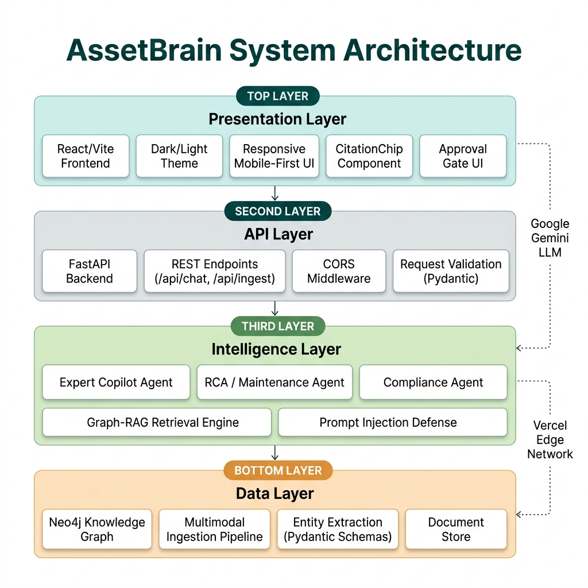
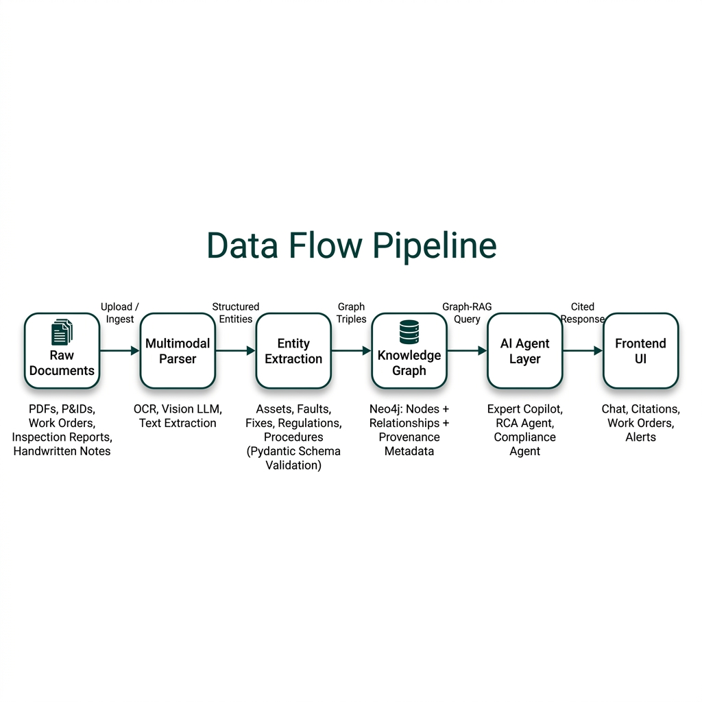
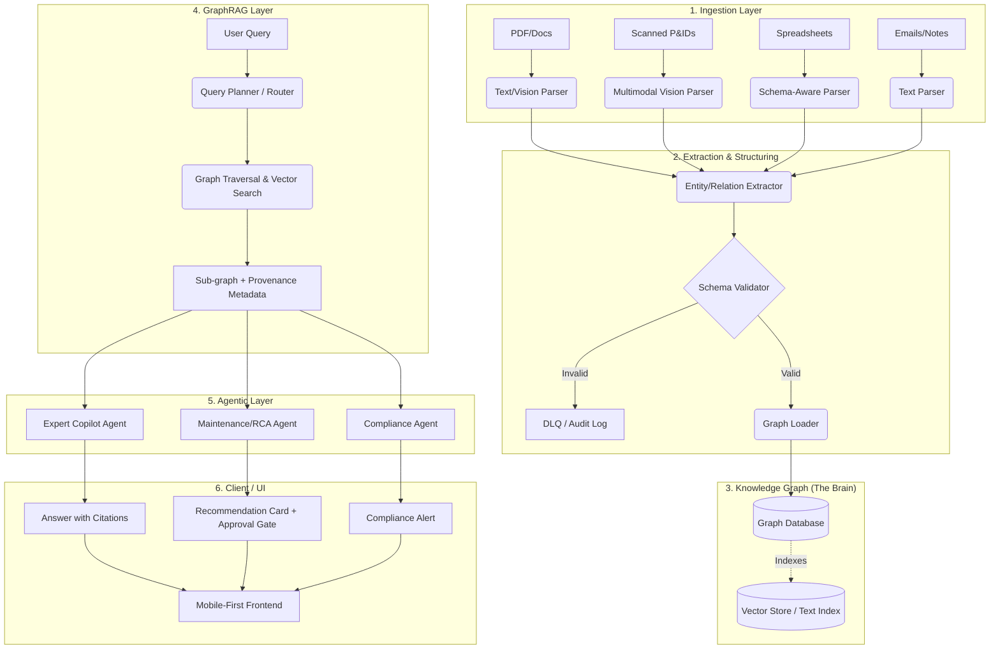
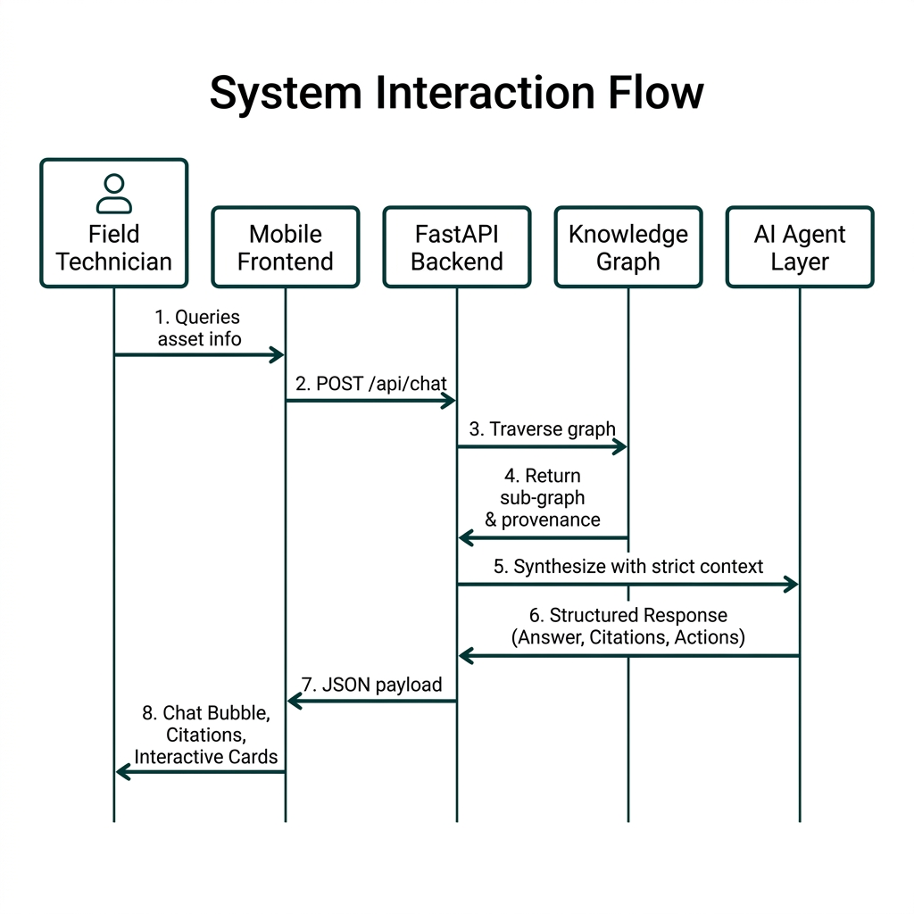
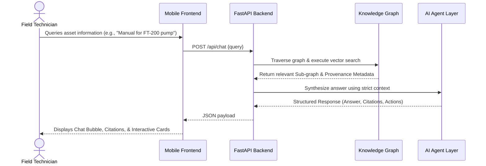
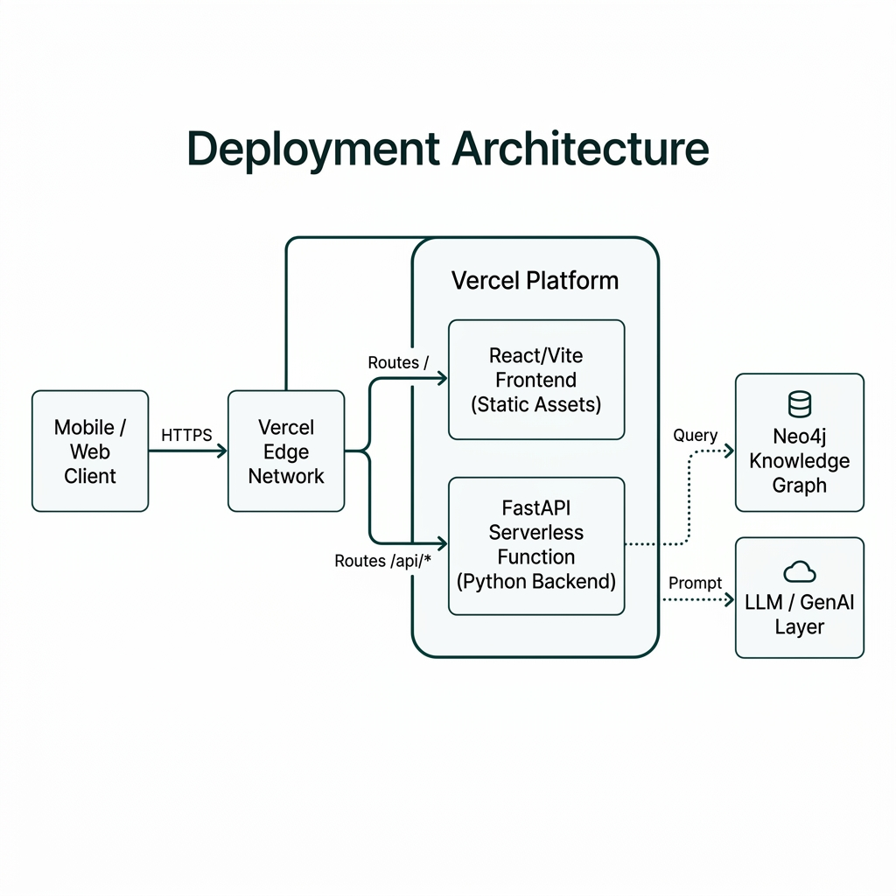
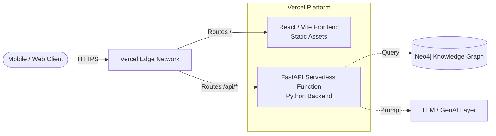

# Unified Asset Reasoning Layer — Product Requirements Document (PRD)

**Status:** Active | **Target:** ET AI Hackathon (Problem Statement 8) | **Version:** 1.0

---

## 1. Executive Summary & Vision

In asset-heavy industries (manufacturing, energy, chemicals), critical knowledge is siloed. Engineering drawings (P&IDs), maintenance work orders, safety procedures, inspection reports, and regulatory filings reside in 7-12 disconnected systems. This fragmentation forces engineers to spend ~35% of their time searching for information and drives 18-22% of unplanned downtime due to uninformed decision-making. 

**Our Vision:** To build an AI-powered "Operations Brain" that ingests these heterogeneous, messy documents and constructs a singular, verifiable Knowledge Graph. This provides technicians with a mobile-first interface to query complex, multi-hop operational questions and receive deterministic, cited answers, ultimately recapturing lost productivity and preventing catastrophic failures.

---

## 2. Problem Statement (The "Why")

1. **Information Fragmentation:** Plant knowledge is scattered across ERPs (SAP, Maximo), EDMS, and physical paper. 
2. **The "Tribal Knowledge" Gap:** With 25% of the experienced workforce retiring this decade, unwritten operational insights are being lost permanently.
3. **The Hallucination Risk:** Standard Generative AI (LLMs with Vector RAG) is insufficient for industrial applications. A hallucinated torque spec or compliance step can result in equipment damage or safety incidents. Precision and provenance are non-negotiable.

---

## 3. Product Principles

- **Graph over Vector:** We reject standard flat RAG. We parse entities (Assets, Faults, Fixes, Regulations) and map their deterministic relationships into a Knowledge Graph. This ensures $O(1)$ precision on complex queries.
- **Traceable Provenance:** Every node in the graph remembers its source document and page number. The AI never asserts a fact without a direct, tappable citation.
- **Recommend, Never Auto-Execute:** For anything touching real equipment, the AI proposes actions (RCA, Work Orders) but strictly enforces a human-in-the-loop approval gate.
- **Mobile-First for the Frontline:** The primary persona is a field technician under time pressure, not a desk-bound engineer. The UI must be highly accessible, with distinct color-coding and iconography.

---

## 4. System Architecture & Design

The system operates via a strict unidirectional pipeline where data maintains full provenance from ingestion to inference. 

### Data Flow & Architecture





<details>
<summary>View as Mermaid (GitHub only)</summary>


</details>

### Core Components Explanation

1. **Ingestion & Extraction:** Processes unstructured PDFs, P&IDs, and informal technician notes. It uses multimodal LLMs to accurately parse complex schematics that standard OCR fails to interpret. It extracts entities and relationships strictly against a rigid industrial schema to prevent hallucinated entity bloat.
2. **Knowledge Graph (The Core):** Instead of relying purely on vector embeddings, the system stores relationships deterministically in a Graph Database (Neo4j). This ensures that querying `(Asset {tag: 'P-204'})-[:HAS_FAULT]->(Fault)` remains O(1) or O(log N) latency even at massive scale.
3. **Retrieval Engine (GraphRAG):** Traverses the graph to resolve multi-hop queries (e.g., "Find all recurring faults on Pump P-204 and check if the latest fix complies with OISD regulations"). Every subgraph extracted carries full provenance (Document ID, Page Number) ensuring responses are completely traceable.
4. **Agentic Layer:** 
    - *Expert Copilot Agent:* Handles user Q&A, formatting answers with strict citations based on retrieved sub-graphs.
    - *Maintenance/RCA Agent:* Proposes Root Cause Analyses and next actions, culminating in a mandatory human approval gate.
    - *Compliance Agent:* Audits proposed procedures against statutory regulations (Factory Act, PESO, etc.) acting as an automated safety layer.

### System Interaction Flow



<details>
<summary>View as Mermaid (GitHub only)</summary>


</details>

---

## 5. Key Use Cases

### Use Case 1: Rapid Troubleshooting
- **User:** Field Technician
- **Scenario:** A seal leak on a critical pump.
- **Action:** Technician queries the system.
- **System Response:** Returns the OEM manual's recommended fix, cross-referenced with a retired engineer's handwritten note from two years ago detailing a specific quirk of this installation.

### Use Case 2: Regulatory Compliance Auditing
- **User:** Plant Manager / Safety Officer
- **Scenario:** Approving a work order for a high-pressure vessel.
- **Action:** System intercepts the proposed work order.
- **System Response:** The Compliance Agent flags a missing mandatory inspection step required by the Factory Act, preventing a regulatory violation.

---

## 6. Success Metrics & ROI

- **Search Time Reduction:** Recapture 2.5 hours per technician/shift (from the current 35% baseline).
- **Downtime Mitigation:** Reduce unplanned downtime by bridging the information gaps that cause 18-22% of failures.
- **Knowledge Retention:** Quantifiable capture of undocumented "tribal knowledge" into the permanent institutional graph.

---

## 7. Setup & Deployment (Engineering Guide)

### Backend (Python/FastAPI)
```bash
cd backend
python -m venv .venv
.\.venv\Scripts\Activate.ps1
pip install -e ".[dev]"
uvicorn main:app --reload
```

### Frontend (React/Vite)
```bash
cd frontend
npm install
npm run dev
```

### Deployment (Vercel Edge & Serverless)
We utilize a unified Vercel deployment strategy. The repository is structured as a monorepo where Vercel natively builds the React frontend as static assets and hosts the FastAPI backend as Serverless Functions (`/api/*`).



<details>
<summary>View as Mermaid (GitHub only)</summary>


</details>

---

## 8. Reference Documentation
- **Architecture & Design:** `docs/ARCHITECTURE.md`
- **Design System & UI Mockups:** `ProductUIMockup.jsx`
- **Business Impact Model:** `ImpactCalculator.jsx`
- **Security & Quality:** `SECURITY.md`, `QUALITY_REPORT.md`
