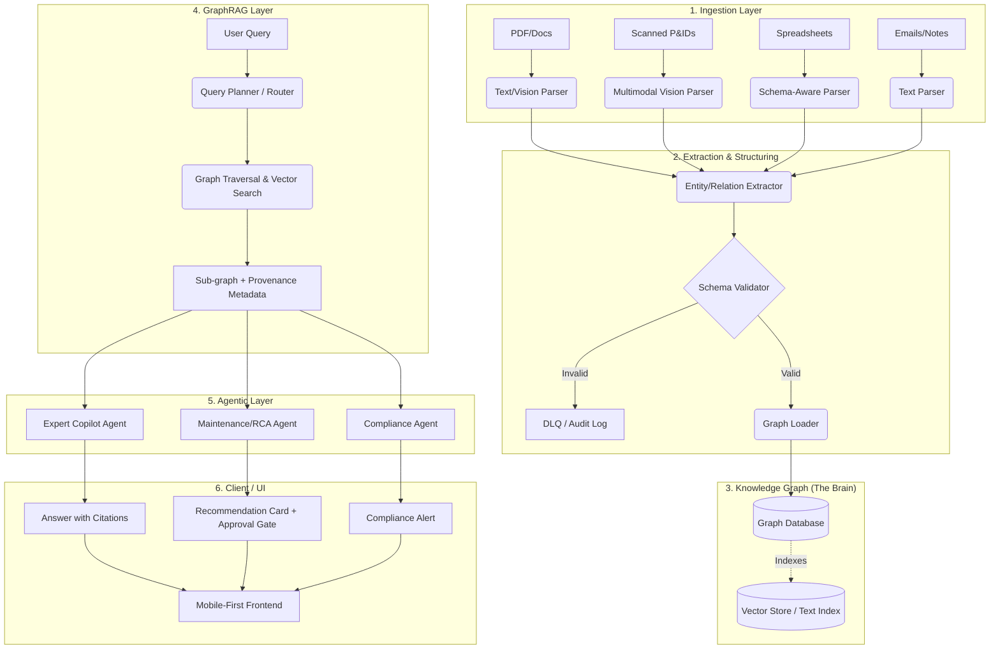

# System Architecture: Unified Asset Reasoning Layer

**Author:** Antigravity (acting as Staff Engineer)
**Date:** 2026-07-12
**Status:** DRAFT

## 1. System Overview & Data Flow
The architecture strictly enforces a pipeline where every piece of data maintains full provenance from ingestion to inference.



**Provenance Survival Principle:** At every arrow crossing above, the source `document_id`, `page_num`, `span`, and `confidence` are attached to the payload. It never drops.

## 2. Core Data Model (Schema)
The graph utilizes a fixed, strictly enforced schema to prevent hallucinated entity bloat.

### Entities (Nodes)
- `Asset`: Core equipment (Properties: `equipment_tag`, `location`, `status`)
- `Fault`: A failure event (Properties: `description`, `severity`, `date`)
- `Fix`: A corrective action (Properties: `description`, `date`)
- `Document`: The source record (Properties: `doc_id`, `type`, `ingested_at`)
- `Technician`: Personnel (Properties: `name`, `role`, `id`)
- `WorkOrder`: Maintenance record (Properties: `wo_id`, `status`, `date`)
- `RegulatoryRequirement`: Compliance rule (Properties: `reference_code`, `body`)
- `InspectionRecord`: Audit record (Properties: `date`, `result`)
- `ProcessParameter`: Operating metric (Properties: `name`, `normal_range`)

### Relationships (Edges)
- `HAS_FAULT` (Asset -> Fault)
- `RESOLVED_BY` (Fault -> Fix)
- `PERFORMED_BY` (Fix | InspectionRecord -> Technician)
- `MENTIONS` (Document -> Any Entity)
- `GOVERNS` (RegulatoryRequirement -> Asset | ProcessParameter)
- `DOCUMENTED_IN` (WorkOrder | InspectionRecord -> Document)

*All edges include a `provenance` property.*

## 3. Technology Stack & Justification

1. **Backend / Orchestration: Python 3.10+ & FastAPI**
   - *Justification:* Asynchronous throughput, deep AI ecosystem integration, type safety with `mypy`.
2. **Graph Database: Neo4j (via LangChain/LlamaIndex)**
   - *Justification:* Native multi-hop traversal logic, ACID compliance. At scale (thousands of docs), vector search alone suffers catastrophic recall drops; indexed graph traversal `(Asset {tag: 'P-204'})-[:HAS_FAULT]->(Fault)` remains O(log N) or O(1).
3. **Frontend: React (TypeScript) + Vite**
   - *Justification:* Strict typing ensures UI contracts (e.g., citation payloads) don't break; mobile-first responsiveness.
4. **Computer Vision (P&IDs): Anthropic Claude 3.5 Sonnet / GPT-4o (Vision)**
   - *Justification:* P&IDs contain spatial relationships that text-only OCR mangles. Using multimodal models with constrained schema outputs handles schematics as a first-class citizen.
5. **LLM Orchestration: Raw API Calls + Pydantic (No monolithic chains)**
   - *Justification:* Langchain abstraction leaks are common. Direct API calls wrapped in Pydantic validators ensure schema enforcement and exact cost predictability.

**Scalability Bottleneck & Mitigation:**
- *Bottleneck:* Re-extracting entire corpuses is O(N) and expensive.
- *Mitigation:* Incremental ingestion. Each document hash is stored. If a new document arrives, only its entities are extracted and merged (UPSERT) into the graph. Graph queries will use indexes on `equipment_tag` and `reference_code` to maintain low latency.

## 4. Top 3 Failure Modes & Guardrails

| Failure Mode | Guardrail |
|--------------|-----------|
| **1. Prompt Injection via Document** (A malicious PDF instructs the agent to ignore safety rules) | **Structural Separation:** The system prompt isolates the `{{document_text}}` payload and enforces that extraction rules supersede payload commands. All system actions are vetted by the approval gate. |
| **2. Graph Bloat / Hallucinated Entities** (The LLM invents "Pump_204", "p-204", "Pump204" as distinct nodes) | **Strict Schema & Normalization:** An entity resolution step normalizes `equipment_tag` via fuzzy match before UPSERT. Output is constrained by `Pydantic` schemas. |
| **3. High Confidence Hallucination** (The Copilot invents an answer that sounds correct but lacks basis) | **Code-Level Enforcement:** The final response prompt is strictly injected with `retrieved_nodes`. The UI suppresses any answer that does not explicitly map to a valid `document_id`. |

## 5. Proposed Folder Structure
```text
c:\et_hackthon\
├── backend/
│   ├── app/
│   │   ├── api/          # FastAPI routes
│   │   ├── core/         # Config, security, logging
│   │   ├── ingestion/    # Parsers (PDF, Vision, Spreadsheets)
│   │   ├── extraction/   # LLM structured output pipelines
│   │   ├── graph/        # Neo4j interactions, schema definitions
│   │   ├── retrieval/    # GraphRAG and vector search
│   │   ├── agents/       # Copilot, RCA, Compliance logic
│   │   └── models/       # Pydantic schemas (Domain Models)
│   ├── tests/
│   ├── pyproject.toml
│   └── main.py
├── frontend/
│   ├── src/
│   │   ├── components/   # UI elements (Cards, Citations)
│   │   ├── hooks/
│   │   ├── pages/        # Mobile-first views
│   │   ├── theme/        # "Warm Liquid-Glass" tokens
│   │   └── api/          # Typed client
│   └── package.json
└── docs/
    └── ARCHITECTURE.md
```
